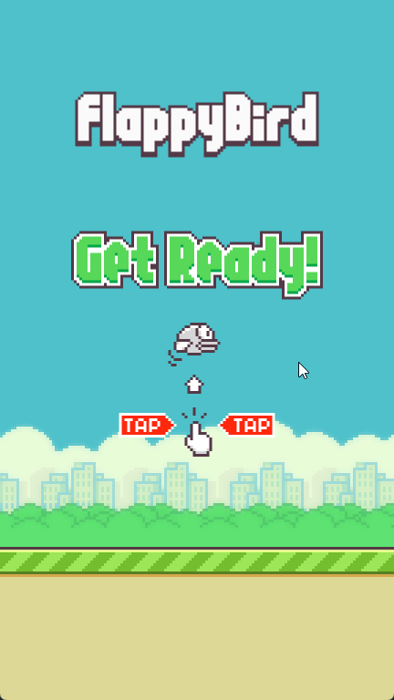

# 🐦 Flappy Bird Remake em Go

Este projeto é uma releitura do clássico Flappy Bird, desenvolvida em Go. Não se trata de uma cópia 1:1 do jogo original, mas sim uma versão inspirada. Foram utilizados os mesmos assets visuais e efeitos sonoros do original, mas a implementação foi feita com base naquilo que eu lembrava e imaginava do jogo, tornando-se uma versão interpretativa e idealizada como uma forma de aprendizado em Go.

## 🎯 Objetivo

O principal intuito deste projeto foi explorar e aprender a linguagem Go, já que essa foi minha primeira experiência prática com Golang. Escolhi recriar o Flappy Bird por ser um jogo simples, mas que ainda assim apresenta conceitos como:

- Manipulação de gráficos e áudio
- Detecção de colisão
- Pontuação
- Controle de loops de jogo
- Organização de código em pacotes
- Embedding de arquivos com embed.FS

## 🛠️ Tecnologias e Ferramentas
- Go — linguagem principal, disponível em: https://go.dev/
- Ebiten — biblioteca para desenvolvimento de jogos 2D com Go, disponível em: https://ebitengine.org/
- Assets do Flappy Bird original — sprites e sons, disponível em: https://github.com/samuelcust/flappy-bird-assets

## 📁 Estrutura do Projeto
```bash
.
├── main.go
├── internal/
│   ├── game/
│   ├── entities/
│   └── utils/
├── assets/
│   ├── images/
│   └── audio/
```

## 🚀 Como rodar

### 🔧 Executar a partir do código-fonte

[Documentação Ebitengine](https://ebitengine.org/en/documents/install.html)

- Instale o Go na sua máquina. A Ebitengine requer o Go 1.22 ou superior.
- Siga as instruções da biblioteca Ebiten para preparar seu ambiente de desenvolvimento (instalação de dependências específicas por sistema operacional).
- Na raiz do projeto execute o comando:

```bash
go run .
```

### 📦 Baixar o executável (Windows)

Se preferir, você pode baixar a versão compilada diretamente na seção [releases](https://github.com/LeandroLBBernardes/flappy-bird-go/releases/tag/v1.0.0) do repositório com o nome `flappy-bird-go.exe`.

**OBS:** ⚠️ Atualmente, o binário está disponível apenas para Windows.


## 📸 Preview



## 🕹️ Comandos

- Barra de Espaço ou Clique do Mouse — Pular
-ESC — Pausar / Retomar o jogo

## 📚 Aprendizados

Durante o desenvolvimento deste projeto, aprendi sobre:

- Sintaxe da linguagem Go
- Como funciona o game loop em jogos 2D com Ebiten
- Organização de código em Go
- Uso de bibliotecas externas como o Ebiten
- Embedding de arquivos estáticos com Go
- Manipulação básica de áudio e imagens com Ebiten

## 📄 Licença

Este projeto é apenas para fins educacionais e aprendizado pessoal.